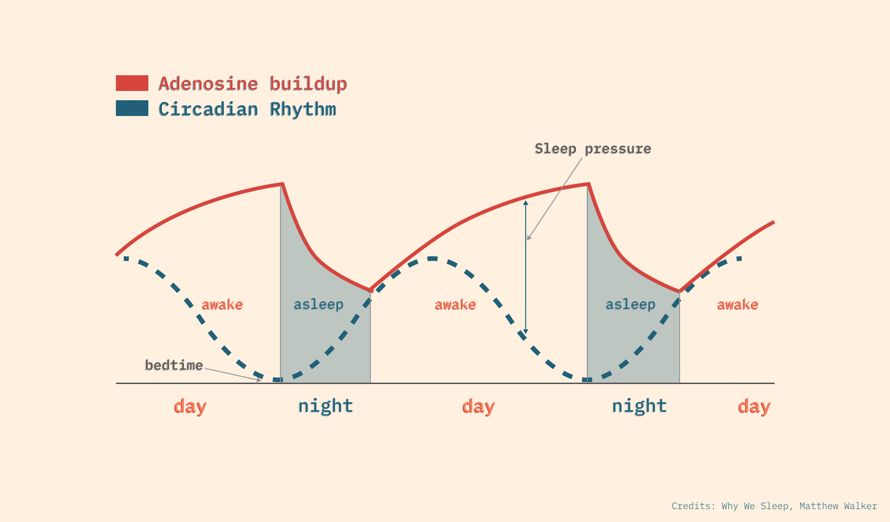

* Falling asleep
    * Circadian rhythm is over 24h, and it is aligned to 24h with day light (melatonin)
        * Evening melatonin 📈
        * Morning melatonin 📉
        * Blue light reduces level of melatonin
    * Adenosine is a central nervous system neuromodulator that has specific receptors
        * When adenosine binds to its receptors, neural activity slows down, and you feel sleepy
        * Caffeine acts as an adenosine-receptor antagonist i.e. it binds to these same receptors, but without reducing neural activity
        * Caffeine half life is approx. 5h
        * When caffeine wares off you have to face old + newly added adenosine, or drink more coffee creates a dependency cycle

 
* Larks/Mixed/Owls
* 46/44/10% men
* 44/44/12% women
* There remain only few hours when everybody sleeps
* REM (Rapid Eye Movements)
    * Dreams
    * High brain activity
        * Lots of “random“ wave noice - like when awake
        * New information is matched with existing knowledge
        * New connections are made - new creative ideas are born
    * Signals from receptors are consumed - possible to wake someone
    * Muscles are numb
    * Emotional healing and fine tuning
        * Not enough sleep easily manifests with lack of self control, irritation, emotional imbalance
        * Difficult emotions are overcome be dreaming about being in similar emotional stages
* NREM (Non-Rapid Eye Movements)
    * Slow synchronised brain activity, new memories are moved from cache to long term storage
    * Signals from receptors are ignored
* Sleep consists of ~1.5h blocks, each block consists of REM and NREM
    * Initial phases have mostly NREM sleep and little REM sleep
    * Over night the proportions reverse
    * Morning sleep consists mostly of REM sleep
* Sleep is crucial for virtually every aspect of life
    * Immune system: a week before vaccinations patients sleeping 6h vs. 8h produce 50% less antibodies as benchmarked against themselves
    * Knowledge persisting (NREM)
    * Knowledge consolidation (REM)
    * Healing / reworking emotions (REM)
* Sleep depravation compounding
    * Consistently getting not enough sleep causes a brain damage and cannot be fixed by sleeping it over the weekend
    * If you sleep too short, the effects compound i.e. sleeping 6h for sufficient time would make you as deprived as someone who just had an all-nighter
* Alcohol
    * After 22h awake the concentration and reaction time is like you were legally drunk
    * Adding alcohol to tiredness have multiplicative effect (not addictive)
    * Alcohol in it’s initial stages acts on prefrontal cortex, where your slow/analytical brain is, so you operate with unconstrained fast/emotional brain
    * Alcohol is sedative, it helps to fall asleep quickly
        * More NREM sleep less REM sleep
        * Decreases overall sleep quality
    * After a day of learning drinking in the evening shows 50% drop in remembered information the next day