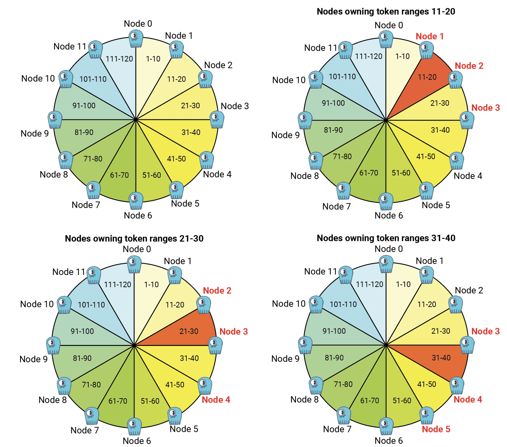
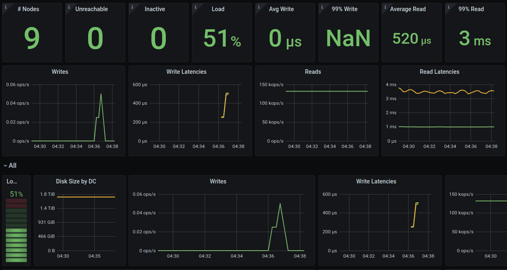
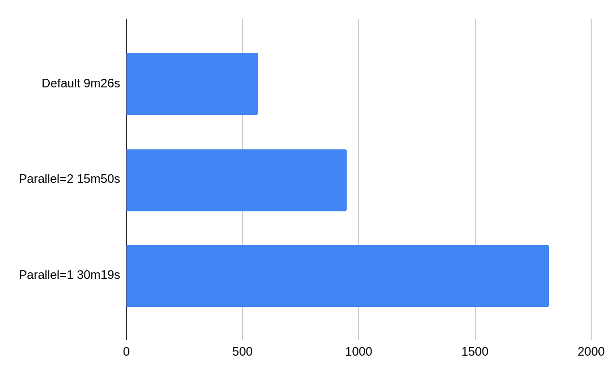
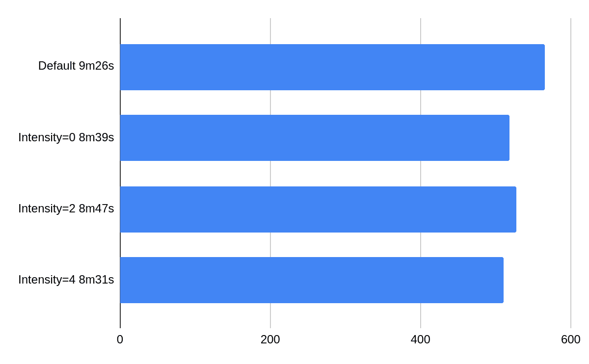
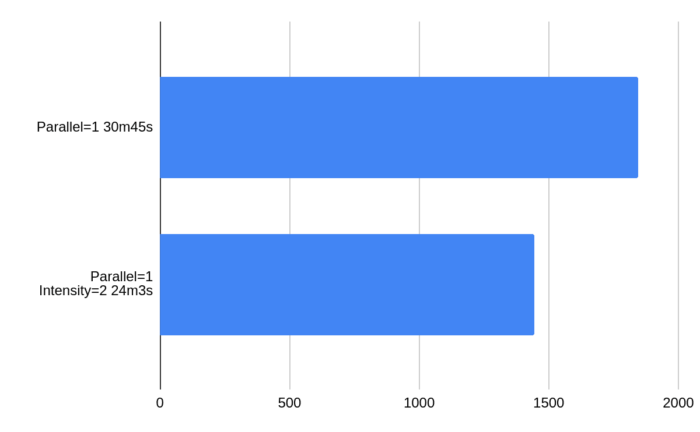

*This blog post has been first published in [ScyllaDB blog](https://www.scylladb.com/author/mmatczuk/).*

We released ScyllaDB Manager 1.0 to help our users manage repairs in February 2018.
Since then a lot of things have changed.
We added the [row-level repair](https://www.scylladb.com/2019/08/13/scylla-open-source-3-1-efficiently-maintaining-consistency-with-row-level-repair/) to ScyllaDB Open Source NoSQL Database, and to the Enterprise version this year.
We just released ScyllaDB Manager 2.2 with a new repair method optimized for row-level repair.

## New repair features in ScyllaDB Manager 2.2

### Parallel repairs

ScyllaDB Manager chooses the optimal number of parallel repairs for a keyspace.
This is beneficial for big clusters.
For example, given a 12 node cluster and a keyspace with replication factor 3, it can be repaired up to 4 times faster than with ScyllaDB Manager 2.1.
This is done by repairing distinct replica sets in a token ring in parallel.
ScyllaDB Manager ensures that each node takes part in at most one ScyllaDB repair job at all times.

The following diagram shows a model of how token ranges are replicated in a token ring.



Token ranges 11-20 are replicated by nodes N1, N2, N3.
When they are repaired we can still repair token ranges 41-50 replicated by nodes N4, N5, N6 and token ranges 71-80 replicated by nodes N7, N8, N9.
We could also repair ranges 101-110 on nodes N10, N11, and N0.
Otherwise Node N0 is idle; we can only repair token ranges 1-10 when nodes N1, N2 (and N3) are done repairing.
The process continues until the whole ring is repaired.

The parallel limit can be described by the following formula: `max_parallel = floor(# of nodes / keyspace RF)`.

In a multi DC setting the keyspace RF in the above formula is a sum of replication factors in different DCs.

## Adjustment of repair intensity to a node capabilities

Repair intensity feature was added in a previous version of ScyllaDB Manager.
It lets you specify how many token ranges (per shard) to repair in a single ScyllaDB repair job.
For ScyllaDB clusters that do not support row-level repair, intensity can also be a decimal between (0,1).
In that case it specifies percent of shards that can be repaired in parallel on a repair master node.

ScyllaDB Manager 2.2 adds support for `intensity=0`.
In that case the number of token ranges is calculated based on node memory and adjusted to the ScyllaDB maximal number of ranges that can be repaired in parallel (see `max_repair_ranges_in_parallel` in ScyllaDB logs).
If you want to repair faster, try setting `--intensity 0`.

## Changing the repair speed in flight

In ScyllaDB Manager 2.2 we added two new sctool repair subcommands: `sctool repair update` and `sctool repair control`.
The former replaces the task update command and extends it with the capabilities to update any repair parameter in an existing repair task.
The latter allows you to change the intensity and parallelism as you repair without ever restarting the task.
In contrast to the update command the control command does not persist the changes for future runs.
The current values for intensity and parallel can be checked in `sctool task progress`.

Example:

Run the following command to adjust the number of token ranges per ScyllaDB repair job to the maximum supported (in parallel) by a repair master node.

```shell
sctool repair control -c prod-cluster --intensity 0
```

## Support for schema changes during repair

In ScyllaDB Manager 2.2 repair goes table by table.
This has many benefits.
On a node ScyllaDB repair jobs need to read fewer files, and we keep coming back to the same files before we move on to the next table.
When there is a new table added, it is not a concern of ScyllaDB Manager since the list of tables to repair is created in the repair init phase.
When a table is deleted during repair, ScyllaDB Manager gracefully handles that and moves on to the next table.

## Small table optimization

Tables that contain less than 1G of data would be repaired in a few ScyllaDB repair jobs, one per replica set.
This saves time on ScyllaDB repair job creation and status checking.
The small table threshold can be changed as a repair command parameter.

## Graceful stop

Whenever a user decides to stop a repair there is a grace period to wait for the ongoing repair jobs before killing them.
The duration of the grace period by default is 30s, the default can be changed in the configuration file.

## New sctool repair progress

Repair progress and duration is displayed per table.
In detailed view users may now see the actual repair progress of a keyspace or a table on each node.

```shell
Status: DONE
Start time: 12 Nov 20 13:17:26 CET
End time: 12 Nov 20 13:21:11 CET
Duration: 3m45s
Progress: 100%
Datacenters:
- dc1
- dc2
 
╭───────────────┬────────┬──────────┬──────────╮
│ Keyspace.
    │ Table  │ Progress │ Duration │
├───────────────┼────────┼──────────┼──────────┤
│ test_keyspace │ data_0 │ 100%     │ 1m6s     │
│ test_keyspace │ data_1 │ 100%     │ 1m11s    │
│ test_keyspace │ data_2 │ 100%     │ 1m12s    │
│ test_keyspace │ data_3 │ 100%     │ 1m10s    │
│ test_keyspace │ data_4 │ 100%     │ 1m10s    │
│ test_keyspace │ data_5 │ 100%     │ 1m6s     │
│ test_keyspace │ data_6 │ 100%     │ 54s      │
│ test_keyspace │ data_7 │ 100%     │ 51s      │
│ test_keyspace │ data_8 │ 100%     │ 1s       │
│ test_keyspace │ data_9 │ 100%     │ 1s       │
╰───────────────┴────────┴──────────┴──────────╯
 
Host: 192.168.100.11
╭───────────────┬────────┬──────────┬──────────────┬─────────┬───────┬────────────────────────┬────────────────────────┬──────────╮
│ Keyspace      │ Table  │ Progress │ Token Ranges │ Success │ Error │             Started at |           Completed at │ Duration │
├───────────────┼────────┼──────────┼──────────────┼─────────┼───────┼────────────────────────┼────────────────────────┼──────────┤
│ test_keyspace │ data_0 │     100% │          514 │     514 │     0 │ 12 Nov 20 13:19:04 CET │ 12 Nov 20 13:20:33 CET │      18s │
│ test_keyspace │ data_1 │     100% │          514 │     514 │     0 │ 12 Nov 20 13:18:39 CET │ 12 Nov 20 13:20:51 CET │      23s │
│ test_keyspace │ data_2 │     100% │          514 │     514 │     0 │ 12 Nov 20 13:18:19 CET │ 12 Nov 20 13:20:41 CET │      17s │
│ test_keyspace │ data_3 │     100% │          514 │     514 │     0 │ 12 Nov 20 13:19:13 CET │ 12 Nov 20 13:20:37 CET │      15s │
│ test_keyspace │ data_4 │     100% │          514 │     514 │     0 │ 12 Nov 20 13:18:19 CET │ 12 Nov 20 13:20:44 CET │      23s │
│ test_keyspace │ data_5 │     100% │          514 │     514 │     0 │ 12 Nov 20 13:18:28 CET │ 12 Nov 20 13:20:48 CET │      23s │
│ test_keyspace │ data_6 │     100% │          514 │     514 │     0 │ 12 Nov 20 13:18:54 CET │ 12 Nov 20 13:19:50 CET │      18s │
│ test_keyspace │ data_7 │     100% │          514 │     514 │     0 │ 12 Nov 20 13:17:41 CET │ 12 Nov 20 13:19:43 CET │      22s │
│ test_keyspace │ data_8 │     100% │          514 │     514 │     0 │ 12 Nov 20 13:18:47 CET │ 12 Nov 20 13:20:52 CET │       0s │
│ test_keyspace │ data_9 │     100% │          514 │     514 │     0 │ 12 Nov 20 13:18:31 CET │ 12 Nov 20 13:19:36 CET │       0s │
╰───────────────┴────────┴──────────┴──────────────┴─────────┴───────┴────────────────────────┴────────────────────────┴──────────╯
```

Benchmark

In the benchmark we run 9 ScyllaDB 2020.1 nodes on AWS i3.2xlarge machines.
Each node has 8 cores, 61GB of memory, and holds approximately 1.8TB of data.
During the tests the nodes are 50% loaded with a read workflow, and 10% of data needs to be repaired, all the nodes have missing data.
The following dashboard shows the system in the stabilisation phase before repair starts.



The following chart presents effects of changing the parallel values between full parallelism (default), two parallel threads and one parallel thread.



The following chart presents effects of changing intensity while running at full parallelism.
One can observe that when the system is loaded adding more repairs does not speed things up too much but it’s still in the range of 10%.



If we take out parallel from the equation changing intensity from 1 (default) to 2 gives 20% improvement.
On an idle cluster intensity is more relevant.



## Summary

ScyllaDB Manager 2.2’s parallel repair mechanism is a great supplement to ScyllaDB row-level repair.
Give it a try today! You can download it from the ScyllaDB Download Center.
Also, if you are interested in learning more about ScyllaDB Manager and repairs, check out [this free lesson](https://university.scylladb.com/courses/scylla-operations/lessons/scylla-manager-repair-and-tombstones/) in ScyllaDB University!