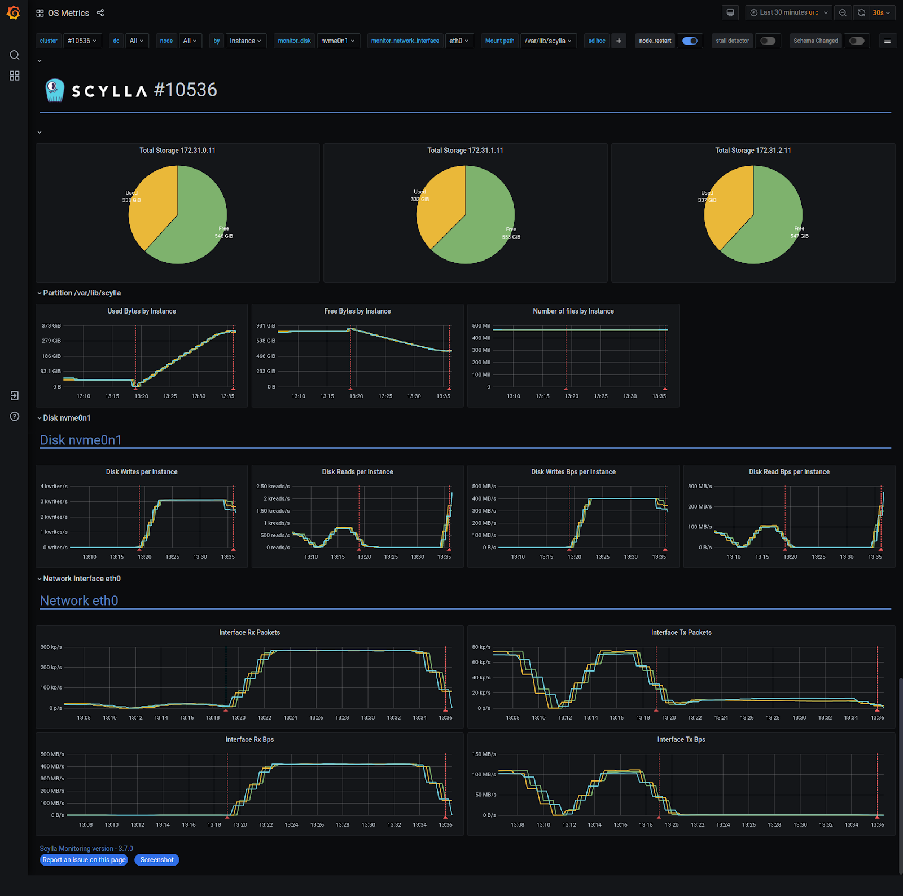

*This blog post has been first published in [ScyllaDB blog](https://www.scylladb.com/author/mmatczuk/).*

Cloning a database cluster is probably the most common usage of backup data.
This process can be very useful in case of a catastrophic event — say you were running in a single DC and it just burnt down overnight.
(For the record, we are always encouraging you to follow our high availability and disaster recovery best practices to avoid such catastrophic failures.
For distributed topologies [we have you covered](https://www.scylladb.com/2021/03/23/kiwi-com-nonstop-operations-with-scylla-even-through-the-ovhcloud-fire/) via built-in multi-datacenter replication and ScyllaDB’s fundamental high availability design.) When you have to restore your system from scratch, that process is going to require cloning your existing data from a backup onto your new database cluster.
Beyond disaster recovery, cloning a cluster is very handy in case if you want to migrate a cluster to different hardware, or if you want to create a copy of your production system for analytical or testing purposes.
This blog post describes how to clone a database cluster with ScyllaDB Manager 2.4.

The latest release of ScyllaDB Manager 2.4 adds a new ScyllaDB Manager Agent `download-files` command.
It replaces vendor specific tools, like AWS CLI or gcloud CLI for accessing and downloading remote files.
With many features specific to ScyllaDB Manager, it is a “Swiss army knife” data restoration tool.

The ScyllaDB Manager Agent `download-files` command allows you to:

* List clusters and nodes in a backup location,<br/>
  example: `scylla-manager-agent download-files -L <backup-location> --list-nodes`
* List the node’s snapshots with filtering by keyspace / table glob patterns,<br/>
  example: `scylla-manager-agent download-files -L <backup-location> --list-snapshots -K 'my_ks*'`
* Download backup files to ScyllaDB upload directory,<br/>
  example: `scylla-manager-agent download-files -L <backup-location> -T <snapshot-tag> -d /var/lib/scylla/data/`

In addition to that it can:

* Download to table upload directories or keyspace/table directory structure suitable for sstable loader (flag `--mode`)
* Remove existing sstables prior to download (flag `--clear-tables`)
* Limit download bandwidth limit (flag `--rate-limit`)
* Validate disk space and data dir owner prior to download
* Printout execution plan (flag `--dry-run`)
* Printout manifest JSON (flag `--dump-manifest`)

## Restore Automation

Cloning a cluster from a ScyllaDB Manager backup is automated using the Ansible playbook available in the ScyllaDB Manager repository.
The download-files command works with any backups created with ScyllaDB Manager.
The restore playbook works with backups created with ScyllaDB Manager 2.3 or newer.
It requires token information in the backup file.

With your backups in a backup location, to clone a cluster you will need to:

* Create a new cluster with the same number of nodes as the cluster you want to clone.
If you do not know the exact number of nodes you can learn it in the process.
* Install ScyllaDB Manager Agent on all the nodes (ScyllaDB Manager server is not mandatory)
* Grant access to the backup location to all the nodes.
* Checkout the playbook locally.

The playbook requires the following parameters:

* `backup_location` – the location parameter used in ScyllaDB Manager when scheduling a backup of a cluster.
* `snapshot_tag` – the ScyllaDB Manager snapshot tag you want to restore
* `host_id` – mapping from the clone cluster node IP to the source cluster host ID

The parameter values shall be put into a vars.yaml file, below an example file for a six node cluster.

## Example

I created a 3 node cluster and filled each node with approx 350GiB of data (RF=2).
Then I ran backup with ScyllaDB Manager and deleted the cluster.
Later I figured out that I want to get the cluster back.
I created a new cluster of 3 nodes, based on i3.xlarge machines.

### Step 1: Getting the Playbook

First thing to do is to clone the ScyllaDB Manager repository from GitHub.

```shell
git clone git@github.com:scylladb/scylla-manager.git
cd scylla-manager/ansible/restore
```

All restore parameters shall be put to vars.yaml file.
We can copy vars.yaml.example as vars.yaml to get a template.

### Step 2: Setting the Playbook Parameters

For each node in the freshly created cluster we assign the ID of the node it would clone.
We do that by specifying the `host_id` mapping in the vars.yaml file.
If the source cluster is running you can use “Host ID” values from “sctool status” or “nodetool status” command output.
Below is a sample “sctool status” output.

```shell
$ sctool status
Cluster: test (77472fd3-a85f-4c8e-bdf5-6c17696ab975)
Datacenter: dc1
╭────┬────────────┬──────────┬──────────┬────────────────┬──────────┬──────┬──────────┬────────┬──────────┬──────────────────────────────────────╮
│    │ Alternator │ CQL      │ REST     │ Address        │ Uptime   │ CPUs │ Memory   │ Scylla │ Agent    │ Host ID                              │
├────┼────────────┼──────────┼──────────┼────────────────┼──────────┼──────┼──────────┼────────┼──────────┼──────────────────────────────────────┤
│ UN │ UP (13ms)  │ UP (5ms) │ UP (2ms) │ 192.168.100.11 │ 7h26m34s │ 4    │ 31.12GiB │ 4.2.1  │ Snapshot │ 3827c1d1-b300-4093-9839-0cf01f1b9346 │
│ UN │ UP (9ms)   │ UP (3ms) │ UP (2ms) │ 192.168.100.12 │ 7h26m34s │ 4    │ 31.12GiB │ 4.2.1  │ Snapshot │ a4f20c78-0a64-490c-b7f4-f52a62667ff8 │
│ UN │ UP (14ms)  │ UP (4ms) │ UP (2ms) │ 192.168.100.13 │ 7h26m34s │ 4    │ 31.12GiB │ 4.2.1  │ Snapshot │ ffa39462-d3f1-46d9-875c-ef89044e951e │
╰────┴────────────┴──────────┴──────────┴────────────────┴──────────┴──────┴──────────┴────────┴──────────┴─────────────────────────────────────
```

If the cluster is deleted we can SSH one of the new nodes and list all backed up nodes in the backup location.

```shell
$ scylla-manager-agent download-files -L s3:manager-test-demo1 --list-nodes
Cluster: prod (9e9b392b-fdd8-4b36-8980-d937949bf6ce)
AWS_EU_CENTRAL_1:
 - 18.194.132.192 (3dda17c5-de2a-4bad-80cd-d695c328601a)
 - 18.197.114.43 (b0b60778-f4cd-4d77-857f-5a076cfa938b)
 - 3.66.107.199 (aeca2b65-8e0c-4158-9886-3ffa54451d2f)
```

Based on that information we can rewrite the `host_id`

```yaml
host_id:
 "35.157.153.136": 3dda17c5-de2a-4bad-80cd-d695c328601a
 "3.68.171.110": b0b60778-f4cd-4d77-857f-5a076cfa938b
 "18.192.18.219": aeca2b65-8e0c-4158-9886-3ffa54451d2
```

When we have node IDs we can list the snapshot tags for that node.

```shell
$ scylla-manager-agent download-files -L s3:manager-test-demo1 --list-snapshots -n 3dda17c5-de2a-4bad-80cd-d695c328601a
sm_20210624122942UTC
```

We now can set the snapshot_tag parameter as snapshot_tag: `sm_20210624122942UTC`.

If you have the source cluster running under ScyllaDB Manager it’s easier to run “sctool backup list” command to get the listing of available snapshots.

Lastly we specify the backup location as in ScyllaDB Manager.
Below is a full listing of vars.yaml:

```yaml
$ cat vars.yaml
# backup_location specifies the location parameter used in Scylla Manager
# when scheduling a backup of a cluster.
backup_location: s3:manager-test-demo1

# snapshot_tag specifies the Scylla Manager snapshot tag you want to restore.
snapshot_tag: sm_20210624122942UTC

# host_id specifies a mapping from the clone cluster node IP to the source
# cluster host IDs.
host_id:
 "35.157.153.136": 3dda17c5-de2a-4bad-80cd-d695c328601a
 "3.68.171.110": b0b60778-f4cd-4d77-857f-5a076cfa938b
 "18.192.18.219": aeca2b65-8e0c-4158-9886-3ffa54451d2f
```

The IPs nodes in the new cluster must be put to Ansible inventory and saved as hosts:

```shell
$ cat hosts
35.157.153.136
3.68.171.110
18.192.18.219
```

### Step 3: Check the Restore Plan

Before jumping into restoration right away, it may be useful to see the execution plan for a node first

```shell
$ sudo -u scylla scylla-manager-agent download-files -L s3:manager-test-demo1 -n aeca2b65-8e0c-4158-9886-3ffa54451d2f \
-d /var/lib/scylla/data/ --dry-run -T sm_20210624122942UTC
Cluster:        prod (9e9b392b-fdd8-4b36-8980-d937949bf6ce)
Datacenter:     AWS_EU_CENTRAL_1
Node:           3.66.107.199 (aeca2b65-8e0c-4158-9886-3ffa54451d2f)
Time:           2021-06-24 12:29:42 +0000 UTC
Size:           324.054G

Download:
 - system_auth.role_attributes (4.933k) to /var/lib/scylla/data/system_auth/role_attributes-6b8c7359a84333f2a1d85dc6a187436f
 - system_auth.role_members (4.914k) to /var/lib/scylla/data/system_auth/role_members-0ecdaa87f8fb3e6088d174fb36fe5c0d
 - system_auth.role_permissions (42.805k) to /var/lib/scylla/data/system_auth/role_permissions-3afbe79f219431a7add7f5ab90d8ec9c
 - system_auth.roles (47.932k) to /var/lib/scylla/data/system_auth/roles-5bc52802de2535edaeab188eecebb090
 - keyspace1.data_0 (40.431G) to /var/lib/scylla/data/keyspace1/data_0-5fb8c700d4e011ebbfe5000000000001
 - keyspace1.data_1 (40.448G) to /var/lib/scylla/data/keyspace1/data_1-5fb89ff0d4e011ebb034000000000002
 - keyspace1.data_2 (40.461G) to /var/lib/scylla/data/keyspace1/data_2-5fb8c702d4e011ebbfe5000000000001
 - keyspace1.data_3 (40.435G) to /var/lib/scylla/data/keyspace1/data_3-5fb8c700d4e011eb8930000000000003
 - keyspace1.data_4 (40.954G) to /var/lib/scylla/data/keyspace1/data_4-5fab5980d4e011eb9c15000000000001
 - keyspace1.data_5 (40.440G) to /var/lib/scylla/data/keyspace1/data_5-5faba7a0d4e011eba8f8000000000003
 - keyspace1.data_6 (40.428G) to /var/lib/scylla/data/keyspace1/data_6-619f8860d4e011eb850d000000000001
 - keyspace1.data_7 (40.456G) to /var/lib/scylla/data/keyspace1/data_7-61a072c0d4e011eb8930000000000003
 - system_schema.aggregates (10.533k) to /var/lib/scylla/data/system_schema/aggregates-924c55872e3a345bb10c12f37c1ba895
 - system_schema.columns (108.946k) to /var/lib/scylla/data/system_schema/columns-24101c25a2ae3af787c1b40ee1aca33f
 - system_schema.computed_columns (10.271k) to /var/lib/scylla/data/system_schema/computed_columns-cc7c7069374033c192a4c3de78dbd2c4
 - system_schema.dropped_columns (10.547k) to /var/lib/scylla/data/system_schema/dropped_columns-5e7583b5f3f43af19a39b7e1d6f5f11f
 - system_schema.functions (10.723k) to /var/lib/scylla/data/system_schema/functions-96489b7980be3e14a70166a0b9159450
 - system_schema.indexes (10.600k) to /var/lib/scylla/data/system_schema/indexes-0feb57ac311f382fba6d9024d305702f
 - system_schema.keyspaces (98.598k) to /var/lib/scylla/data/system_schema/keyspaces-abac5682dea631c5b535b3d6cffd0fb6
 - system_schema.scylla_tables (100.185k) to /var/lib/scylla/data/system_schema/scylla_tables-5d912ff1f7593665b2c88042ab5103dd
 - system_schema.tables (107.300k) to /var/lib/scylla/data/system_schema/tables-afddfb9dbc1e30688056eed6c302ba09
 - system_schema.triggers (10.203k) to /var/lib/scylla/data/system_schema/triggers-4df70b666b05325195a132b54005fd48
 - system_schema.types (10.322k) to /var/lib/scylla/data/system_schema/types-5a8b1ca866023f77a0459273d308917a
 - system_schema.view_virtual_columns (10.369k) to /var/lib/scylla/data/system_schema/view_virtual_columns-08843b6345dc3be29798a0418295cfaa
 - system_schema.views (13.039k) to /var/lib/scylla/data/system_schema/views-9786ac1cdd583201a7cdad556410c985
```

With `--dry-run` you may see how other flags like `--mode` or `--clear-tables` would affect the restoration process.

### Step 4: Press Play

It may be handy to configure default user and private key in `ansible.cfg`.

```shell
$ cat ~/.ansible.cfg 
[defaults]
remote_user = support
private_key_file = /path/to/aws/pem/file
```

When done, “press play” (run the `ansible-playbook`) and get a coffee.
The restoration took about 15 minutes on a 10Gb network.
The download saturated at approximately 416MB/s.



### CQL Shell Works

```shell
cqlsh> SELECT id FROM keyspace1.data_0 LIMIT 10;

id
--------------------------------------
b76af606-e6fa-4001-8660-a7c86ea0f545
71187315-5dd7-4df6-9fc3-324aee6b6456
a19d1824-6301-41ca-97b9-c85200e8f070
5d29fd1c-cda3-4efe-b6d7-96061c2a5257
e4c1411b-7de5-45d6-b375-d02332f0394c
4b3ca60a-b1e3-410d-ad7a-27c9ab22734a
a302b84c-3da3-468c-a628-28000dd5cc7f
debb2d34-f107-41c1-b3e1-49feed15982b
ba660b34-d2b1-4e1e-859a-f9bc66617ca6
93a39da5-c23b-4590-952c-1e86a09d60a9

(10 rows)
```

After completing the restore, it’s recommended to run a repair with ScyllaDB Manager.

### Next Steps

If you want to try this out yourself, you can get a hold of ScyllaDB Manager either as a ScyllaDB Open Source user (for up to five nodes), or as a ScyllaDB Enterprise customer (for any sized cluster).
You can get started by heading to our Download Center, and then checking out [the Ansible Playbook](https://github.com/scylladb/scylla-manager/tree/master/ansible/restore) in our ScyllaDB Manager Github repository.
