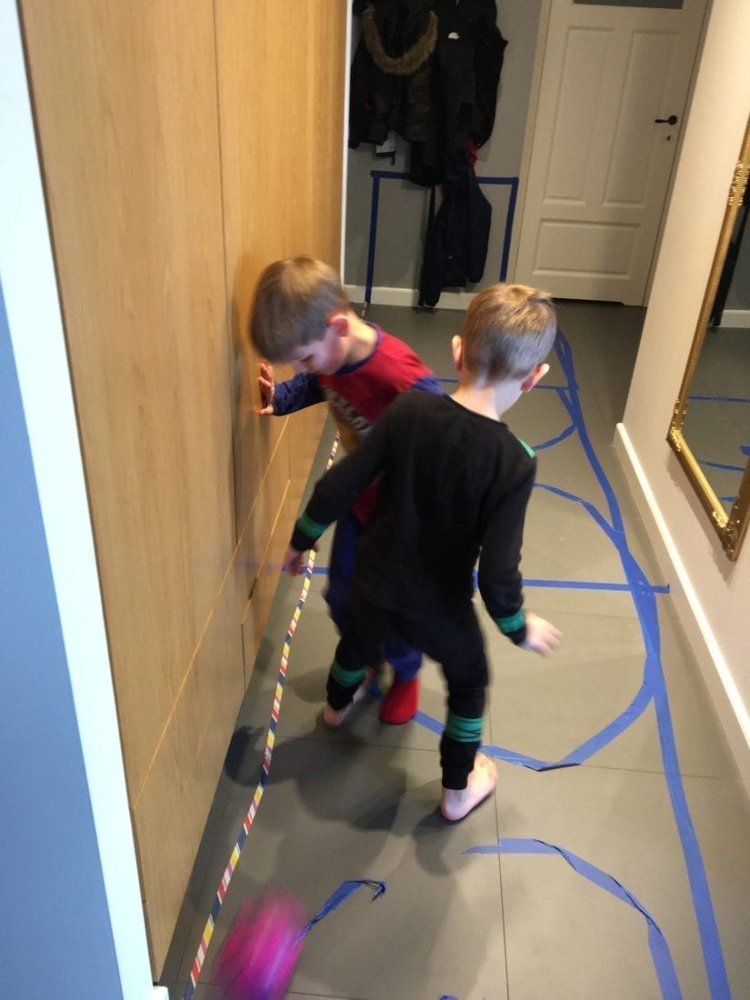

*This blog post has been first published in [ScyllaDB blog](https://www.scylladb.com).*

When offices close due to COVID-19 pandemic, many more of us will work from home, perhaps for the first time.
Some people are thrilled about this idea.
In social media you can find opinions like [Coronavirus Will Make it Hard to Go Back to the Office after Experiencing the Benefits of Remote Work](https://www.linkedin.com/pulse/coronavirus-make-hard-go-back-office-after-benefits-remote-chris-herd/).
While the benefits they highlight are true it looks to me like an advertisement for remote work, completely disregarding costs and the downsides of it.

Also, many people who have been used to remote work may have their normal routines disrupted.
That Internet café you’re used to going to, may be closed.
Kids and spouses at home may provide distractions that you normally wouldn’t face.
In this post I’d like to share my experience with working from home for the last three years and how I’ve had to accommodate changes to my routine in recent days.

For the first year and a half of my WFH journey, I was alone the whole day.
At the beginning, I felt awkward.
If you feel like that too, it’s completely normal.
I stopped noticing that I’m alone only when I was immersed in work.
As you enter [the zone](https://www.theladders.com/career-advice/how-to-get-into-the-zone-and-be-more-productive) you can forget about the whole world.
Working from home can be a very productive time.
There are few interruptions.
You can just go with the flow.

For the next six months my wife, who was pregnant at the time, joined me at home.
After that time a baby was born.
I needed to adjust and learn how to work again.
Now in the advent of COVID-19 homeschooling it looks like things are going to change once more.

## The Upsides and Downsides of Remote Work

Upsides:
* Zero commute time
* Establish your own routine/ritual
* Greater productivity if you can get into “the zone”
* Less time-wasting meetings
* Refrigerator is right there

Downsides:
* Distractions of home environment
* More sedentary
* Greater risk of burnout
* Less bonding with colleagues
* No ping-pong or other office games
* Refrigerator is right there

## The Home Office

Working in an office can be great.
Companies pay a great deal of attention to employee happiness.
Offices are nice, coffee is good, food is free, the Internet never breaks, and there is a good supply of toilet paper! There are some things about it you’ll need to emulate while working from home to avoid going nuts.
As a remote worker your first task would be to organize your work environment.
But first, let’s look at how to get in that “office” mindset.

People usually complain about a lengthy commute to the office, but commuting, when repeated, becomes a ritual that prepares you for work.

> The power of a ritual, or what I like to call a pre-game routine, is that it provides a mindless way to initiate your behavior.
> It makes starting your habits easier and that means following through on a consistent basis is easier.
> — [James Clear](https://jamesclear.com/twyla-tharp)

I have experienced that firsthand.
When I tried to get up early and started working there seemed to be a mismatch between my body and brain.
It was hard to get to the state of flow and oftentimes my performance was poor especially when optimizing my commute down to just a few seconds.
The following video shows the morning commute of Daniel Stenberg, the creator of curl back in 2019.



At first when I did not feel like working I did a little bit of cleaning up or went for a walk by a nearby canal.
After that I could get to work and be quite productive.
Six months at home without any physical activity made me feel weak and affected my mood.

When you work from home you can significantly reduce the number of steps you take each day, and that increases the possibility of a stroke and other heart disease.
To stay healthy it’s generally recommended taking [10k steps a day](https://blog.fitbit.com/should-you-really-take-10000-steps-a-day/) or perform other kinds of physical activity.
I made a new year’s resolution to stay fit.
After experimenting with different options, my routine now consists of getting kids to school, and going for a run every other day.
My brain gets some extra oxygen, and my body gets a clear signal that it’s time to go to work.
When I’m physically tired, I feel less of a need to mindlessly walk around the house.

## Office Culture

As a remote worker, it’s kind of difficult to be part of office gossip.
“Watercooler conversations” rarely happen for those of us spread across the globe.
On a daily basis, we use Slack for cheering and sending emojis, email for important topics, Google Docs for working on designs and Google Meet for all sorts of meetings.
(I won’t go into too many details, since you can find many resources on-line).
You may find these tools surprisingly effective in getting things done.
Yet while you can chat on Slack, to me it’s like hiking vs looking at pictures of mountains.
I like looking at pictures but no matter the quality of the image, it’s going to pale in comparison to the real thing.

Technically you can have a chat or a call with anyone on any topic.
Some companies even have coffee break calls you can join if you wish to chat with your colleagues on topics like: hobbies, interests, sports, and so on.
The problem is that it doesn’t happen naturally, it’s difficult to chime in.
Spontaneous interactions work best when you’re physically present.
As my colleague Ivan pointed out:

> In a remote setting you are getting much lower quality interactions and communications with your colleagues.
> You have to put an additional effort into supporting your online communication environment.
> Here company culture overall plays a huge difference.

Remote culture builds on an observation that [meetings are toxic](https://m.signalvnoise.com/meetings-are-toxic/), and they really are.
I can remember countless hours wasted on useless meetings.
Many of them I attribute to Scrum or a poor implementation of it.
Only after working remotely for a while I realized that the best part of those wasteful meetings was pre-meeting and post-meeting meetings.
That is the time when me and my colleagues had a chance for a free chat and exchanging wild ideas.

This is very difficult to replicate in a remote setting — it does not scale very well.
In a room full of people you can have multiple conversations going on in parallel.
You will listen to your partner and can ignore anyone else.
On a video call there must be only one person speaking at a time, otherwise it’s pure noise.
Group chats / threads have the same shortcoming; they become noise if we start multiplexing different conversations in one channel.

Offices are full of other social activities that will leave you feeling like you’ve missed out.
For instance, guys in our Israeli headquarters are huge fans of table tennis.



Playing table tennis was my favorite entertainment back when I worked in an office too.
We all know that these common experiences play an important role in building team spirit.

To overcome these issues, as a company, we try to meet twice a year so that we can [interact in person with our colleagues](https://www.scylladb.com/2019/06/27/scylladb-internal-developer-summit/) regardless of where they live.
The problem these days is that many such face-to-face events will have to be postponed.

## Perceived Proximity

Scientists who have studied open source communities and distributed companies have devised a term “[Perceived Proximity](https://www.researchgate.net/publication/228271751_Perceived_Proximity_in_Virtual_Work_Explaining_the_Paradox_of_Far-But-Close)” to describe the phenomenon where you can have a developed relationship and feel close with someone who lives far away, even without seeing the person.

> Members of teams with low levels of physical proximity do not necessarily feel distant from each other.
> Conversely, being physically proximate to team members does not always lead to feelings of closeness, as shown by decades of research on co-located teams and their outcomes.
> — [Perceived Proximity in Virtual Work](https://www.researchgate.net/publication/228271751_Perceived_Proximity_in_Virtual_Work_Explaining_the_Paradox_of_Far-But-Close)

According to the research, frequency of communication matters.
Chitchat on group chats or Slack channels can help build the team spirit, so yes even Slacking around on Slack is OK.
In my view, it’s also important to see that you are not alone, and in case you have a problem, there is someone to help you out.
We have an #engineering Slack channel where you can ask any work-related questions.
It usually works flawlessly and people are eager to help.

Not only frequency but also depth of conversations is important.

> Depth and interactivity of communication also act to make distant others more predictable and understandable and hence seemingly more proximal.
> This occurs through the mechanism of reducing uncertainty.
> — [Perceived Proximity in Virtual Work](https://www.researchgate.net/publication/228271751_Perceived_Proximity_in_Virtual_Work_Explaining_the_Paradox_of_Far-But-Close)

To reduce uncertainty, your camera should be on at all times while on a video call.
Dress yourself nicely and tidy your room.
Be professional.
Working in pajamas doesn’t fly in the long run.

If you are managing a team, please note that doing one-on-one calls with your team members is very important.
It gives you an opportunity for a deeper conversation, as mentioned in the research, and helps you get to know each other better.
If you do not have any items to discuss, [GitLab advises](https://about.gitlab.com/handbook/leadership/1-1/#conducting-a-1-1) to start with one of the following questions:

* “Is there anything that needs clarity?”
* “What are you most proud of/excited about?”
* “Is there anything you think is important to mention that happened since our last 1-on-1?”
* “What are potential troubles you see for the team?”
* “What are potential troubles you see for the company?”

And so on.
These open-ended questions can be helpful in breaking the ice.

Generally speaking the “Perceived Proximity” tricks work.
I think that having a meaningful discussion and seeing that we share values is very effective in building team spirit.
The problem here is that these kinds of conversations rarely happen outside of 1-on-1s in a remote setting.

## Home Sweet Home

Companies are very good at creating an “Office Abstraction Layer” where everything you need is available, even before you think about it.
While working from home, you become a [Manager of One](https://signalvnoise.com/posts/1430-hire-managers-of-one).
This means two things: first you have to shape your work environment and second you have to create your work schedule.
The initial act of creation is never really over.
You’ll find yourself checking new gear to make things easier or experimenting with work times and routines to see what works best.
This gives a fantastic feeling of freedom to choose where and when you work.

Getting the work environment right is extremely important.
If you do it right it will boost your productivity.
If you do it wrong, working from home will be a nightmare.
If snacks and chips just lay around you will eat them.
On the other hand if a bottle of water is within your sight every time you feel thirsty you will drink.
Make desired behaviors easy, attractive and satisfying and undesired ones difficult and unattractive.

## Where to Work

Note that working remotely or being a [Digital Nomad](https://en.wikipedia.org/wiki/Digital_nomad) does not always mean “Home Office.” If you think about working from home as a long-term solution, I’d recommend buying a proper desk and chair that would make you feel comfortable.
If after a day of work you have back pain, there is something clearly wrong with your setup.
Working from a kitchen table is acceptable for only a short period of time.

There are opinions that you should change where you work.
As for me, I’m working from what I call a “bedoffice” (an office niche in the bedroom).
At the beginning I evaluated a few options of where to put my desk and after I made up my mind I stuck with it.
Not walking around with work helps me to keep the “office zone” as small as possible and also keeps it separated from the rest of the house.

## When to Work

Technically speaking you can do as you please as long as it’s effective.
Experiment and check what works best for you.
Stick with your schedule, this will help in changing from office mode to home mode and vice versa.
Similar to the before work ritual, it’s good to have an after work ritual that would give your brain time to reset; leaving the office is a process.

Working from home has a trap in it.
Teams are geographically dispersed and there is work going on literally 24/7.
If you like your work or have a sense of responsibility for your project you might feel like you can never get out.
There is always another bug to fix, another email to read, another client to help; the list goes on.
My colleague Nikki (remote/home worker since 2006) puts it that way:

> I don’t think about the number of hours I work in the week so much as the number of steps I take toward retiring my goals.
> I also really enjoy my job so this doesn’t feel like work but more like reading a book that’s so great I can’t put it down; I can’t get enough.
> Not having to commute or do lunches and coffees and things means I find unique pockets of time to participate in my other passions — something that would be very hard otherwise.
> I have a friend who likes to say “Nikki does more before you wake up in the morning than most people do in a day.” I like things this way.

I feel the same way, I set a timer for 5PM and when the timer beeps, I get up and go pick-up my kids from school.
I started this habit after the time I forgot to get them, having been deep in a debugging session! My concern, however, is that “I can’t get enough” narrows your perspectives.
Reading a book or watching a video from a conference is a much better investment in your career.

When you stop working, just turn off the computer, disable notifications on your phone, and take care of your life.
Now as you are a manager of one, send people home at 5.

## Eating

The thing I hate most about working remotely is how miserable the eating experience is.
Usually lunchtime is a daily ceremony that everyone is waiting for from the very moment they enter the office building.
People get together, they eat and drink, cheer and laugh.
When working remotely the common wisdom says that you can read a #random channel while you digest your sandwich, and this is very disappointing.

Getting the food is a separate “problem” that you need to think about and plan in advance.
On the other hand it can motivate you to eat more healthy food.

The problem of lonely lunches was completely resolved when my wife and children joined me.
In the era of COVID-19 we have a full family by the table.

## Burnout

[Burnout](https://www.who.int/mental_health/evidence/burn-out/en/) is a work-related chronic stress syndrome made up of exhaustion, cynicism, and lack of professional efficacy.

How many times have you heard something like “Working from home can bring freedom and stress-free job satisfaction?” This is not true.
Many distributed companies have articles on how to avoid burnout.

> [Burnout is a reality for thousands of developers](https://hn.algolia.com/?query=burnout&sort=byPopularity&prefix&page=1&dateRange=all&type=story), and it also affects those working remotely.
> In fact, DigitalOcean’s recently published report, [Currents: A Seasonal Report on Developer Trends in the Cloud – Remote Work Edition](https://www.digitalocean.com/currents/july-2019/), revealed that 66% of remote developers suffer from burnout symptoms.
> And the percentage is even higher (82%) for developers in the United States.
> — [DigitalOcean](https://blog.digitalocean.com/avoiding-burnout/)

The DigitalOcean report shows that risk of burnout for remote developers is 2% higher than for in-house developers.
Burnout is a serious topic, beyond the scope of this blog post, and it’s important to be aware of it!

## Kids Go Remote

Now I’m faced with a new situation.
We are all at home and my first grader has lessons on-line.
The lessons today were not a huge success due to technical and social challenges.
Children started talking with one another.
Then, when more kids joined, they yelled louder so that the other kid they wanted to talk to could hear.
It was an incredible mess.
I hope things get better tomorrow.

If you try to work at home while you’ve got others around make sure you have a door.
Yes, you need to put yourself on lockdown.
Kids and pets may think that since they are at home and you are at home it must be a weekend.
If you ignore them they will fight for your attention.
When you have a hideout getting anything done is much easier.

Home can become quite a noisy place when other people are around.
Except for the usual noise like a street nearby, the wind blowing, a neighbor redecorating his house, now you can have kids yelling and screaming.

Even without other people at home I still maintain the habit of working with my headphones on.
It’s another hint for my brain that I’m at work.
Headphones are also good for video calls, as without headphones there is oftentimes a loop or echo effect.
As disturbances may happen while you are on a call I recommend deploying a [mute/unmute keyboard shortcut](https://about.gitlab.com/handbook/tools-and-tips/#shush).

I’m not sure I will be able to work effectively while school and kindergarten are closed.
My three years of expertise has little to do here.
Lockdown requires an additional pair of hands and parent involvement in helping the kids with their homework and managing their emotions.

## Conclusion

After working remotely for the last three years, I think that remote work is great for working parents.
As a parent, saving time on commuting is invaluable.
For a typical commuter your commute time gets longer with kids.
For me it added about 20 minutes to take them to daycare/school.
With remote work you can reclaim all that time.
If your commute takes 1 hour each way you can save up to 10 hours a week! That makes it possible to have a great work-life balance but only if you plan it wisely.

Don’t forget about burnout protection.
Kids will protect you from burnout by providing an endless stream of problems, but please note that burnout is work-related chronic stress.
Kid-related chronic stress is called “parenthood.”
